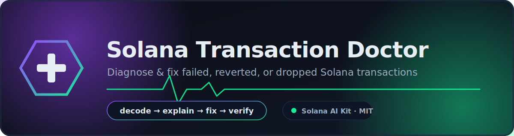
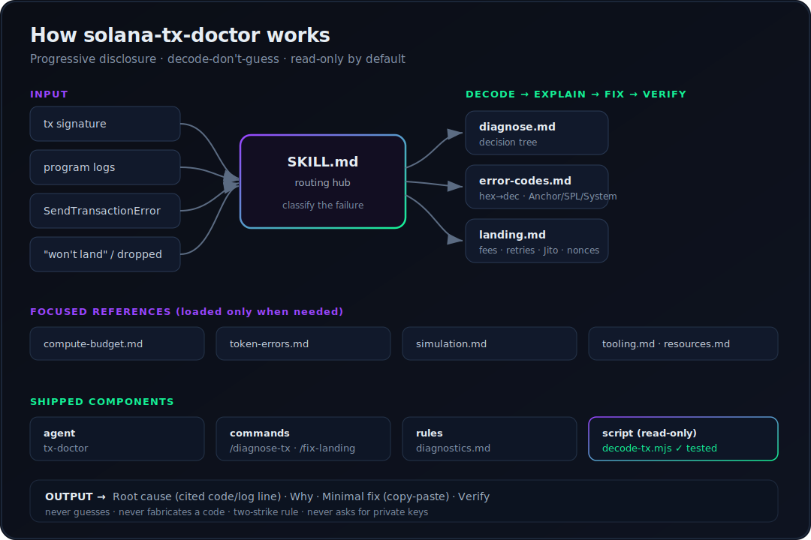
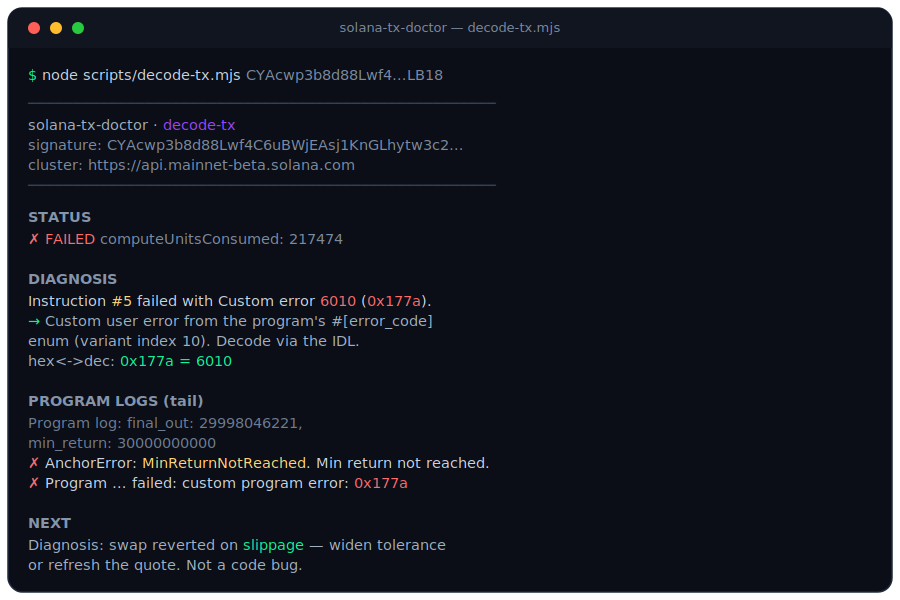

<p align="center">
  
</p>

<p align="center">
  
  
  
  
</p>

# Solana Transaction Doctor 🩺

**An AI skill that diagnoses and fixes failed, reverted, or dropped Solana transactions.**

A skill for [Claude Code](https://claude.com/claude-code) / Codex and the [Solana AI Kit](https://github.com/solanabr/solana-ai-kit). Paste a signature, a wall of program logs, or a `SendTransactionError`, and the skill runs a disciplined **decode → explain → fix → verify** loop: it pulls the evidence, classifies the failure, decodes the exact error code, and prescribes the *minimal* fix — never guessing.

> Built for the [Superteam Brasil "Ship useful agent skills"](https://github.com/solanabr/skill-bounty) bounty.

---

## The problem it solves

Every Solana builder loses hours to the same wall:

```
Program log: AnchorError occurred. Error Code: ... Error Number: 6001 ...
Program <id> failed: custom program error: 0x1771
```

…or a transaction that simply **never lands**, or a `0x1` that could mean five different things depending on which program raised it. The information to diagnose it is *always there* — in the logs, the error code, and the simulation — but reading it correctly requires knowing:

- how to convert `0x1771` → `6001` and which error table that falls in (Anchor framework? custom user error? SPL Token? System?),
- the difference between a **program-logic** failure and a **landing/lifecycle** failure (dropped, expired, fee race),
- the Anchor constraint/account code map (`ConstraintSeeds`, `AccountNotInitialized`, …),
- the Token-2022 extension gotchas (transfer hooks, frozen-by-default, decimals),
- and how to make sends actually land in 2026 (priority fees, tight CU limits, retry-against-blockhash, Jito, durable nonces).

This skill packages all of that into a token-efficient, progressively-loaded reference plus a working decoder — so any agent becomes a transaction-debugging expert on demand. **Nobody in the ecosystem has packaged the failure side of Solana as a skill.**

## What it does

<p align="center">
  
</p>

| Capability | Where |
|------------|-------|
| Classify **any** failure from its logs/error into a family | `skill/diagnose.md` |
| Decode **any** error code (Anchor 100–4100, custom 6000+, SPL Token, System) | `skill/error-codes.md` |
| Fix transactions that **don't land** (priority fees, CU limits, retries, Jito, durable nonces) | `skill/landing.md` |
| Fix `exceeded CUs` / compute-budget overruns | `skill/compute-budget.md` |
| Diagnose SPL Token & **Token-2022** failures (ATAs, frozen, hooks, decimals) | `skill/token-errors.md` |
| Simulate before/after sending and read the result correctly | `skill/simulation.md` |
| The toolbox: RPC, `solana confirm`, explorers, Helius APIs, the decoder | `skill/tooling.md` |

Plus a specialized **agent** (`tx-doctor`), two **commands** (`/diagnose-tx`, `/fix-landing`), enforced **rules** (`rules/diagnostics.md`), and a zero-dependency read-only **decoder script**.

## Worked example (real, not a mock)

The bundled decoder run against a real failed mainnet transaction:

<p align="center">
  
</p>

```bash
node scripts/decode-tx.mjs CYAcwp3b8d88Lwf4C6uBWjEAsj1KnGLhytw3c2DQR3QUhHfcy6d7t7kmdVs33knuvW9kby3UCUUuWBwGtVXLB18
```
```
STATUS
  ✗ FAILED      computeUnitsConsumed: 217474

DIAGNOSIS
  Instruction #5 failed with Custom error 6010 (0x177a).
  → Custom user error from the program's #[error_code] enum (variant index 10).
  hex<->dec: 0x177a = 6010

PROGRAM LOGS (tail)
  Program log: final_out: 29998046221, min_return: 30000000000
✗ Program log: AnchorError ... Error Code: MinReturnNotReached. Error Number: 6010. Min return not reached.
✗ Program ... failed: custom program error: 0x177a
```

**Diagnosis:** a swap reverted on **slippage** — the output (`29998046221`) fell below the user's `min_return` (`30000000000`). **Fix:** widen slippage tolerance or refresh the quote before sending — not a code change. The decoder converted the hex, located the error in the custom (6000+) range, and surfaced the exact `AnchorError` line in seconds.

## Install

```bash
git clone https://github.com/<you>/solana-tx-doctor.git
cd solana-tx-doctor
./install.sh            # installs to ~/.claude/skills/solana-tx-doctor
```

Or drop it straight into the Solana AI Kit (it follows the kit's skill shape exactly):

```
~/.claude/skills/solana-tx-doctor/
```

Then ask your agent things like:

- *"Why did this transaction fail? `<signature>`"*
- *"`custom program error: 0x1771` — what is this?"*
- *"My transactions keep getting dropped, make my sender reliable."*
- *"`AnchorError ... ConstraintSeeds` — what's wrong?"*
- *"Simulate this before I send it."*

Or use the commands directly: `/diagnose-tx <signature>` · `/fix-landing <path/to/sender.ts>`.

### Use the decoder standalone

The decoder needs only Node 18+ (built-in `fetch`), no install, no keys:

```bash
node scripts/decode-tx.mjs <SIGNATURE>                       # mainnet
node scripts/decode-tx.mjs <SIGNATURE> --url $HELIUS_RPC      # devnet/custom RPC
```

It is **read-only** — it fetches and decodes, and never signs, sends, or touches funds.

## Structure

```
solana-tx-doctor/
├── skill/
│   ├── SKILL.md            # entry point + routing hub (progressive disclosure)
│   ├── diagnose.md         # master decision tree: classify any failure
│   ├── error-codes.md      # decode reference: Anchor / SPL / System codes
│   ├── landing.md          # dropped/expired txs: fees, retries, Jito, nonces
│   ├── compute-budget.md   # exceeded CUs: measure & tune compute
│   ├── token-errors.md     # SPL Token & Token-2022 failures
│   ├── simulation.md       # simulate before/after sending
│   ├── tooling.md          # RPC, CLI, explorers, Helius, the decoder
│   └── resources.md        # curated current references
├── agents/
│   └── tx-doctor.md        # the diagnostician agent
├── commands/
│   ├── diagnose-tx.md      # /diagnose-tx <sig|logs|error>
│   └── fix-landing.md      # /fix-landing <sender file>
├── rules/
│   └── diagnostics.md      # decode-don't-guess, two-strike, read-only safety
├── scripts/
│   └── decode-tx.mjs       # zero-dep, read-only transaction decoder
├── assets/                 # banner, architecture diagram, demo (SVG)
├── CLAUDE.md               # config hub for the kit
├── install.sh
└── LICENSE                 # MIT
```

## Design principles

- **Decode, don't guess.** Every conclusion cites a specific error code or log line. Custom (6000+) codes are decoded from the program's IDL — never invented. Enforced in `rules/diagnostics.md`.
- **Progressive / token-efficient.** `SKILL.md` routes; each `.md` loads only when its failure family is in play.
- **Current to the 2026 stack.** `@solana/kit` + web3.js v1, Anchor 0.31+ error format, versioned txs, Token-2022, priority-fee landing.
- **Safe by default.** Read-only investigation; the bundled script never signs or sends; the skill never asks for private keys.
- **Slots into the kit.** Same shape as the reference `solana-game-skill` — `SKILL.md` hub, `agents/`, `commands/`, `rules/`, installer.

## License

MIT — see [LICENSE](LICENSE). Free to merge or submodule into the Solana AI Kit.
